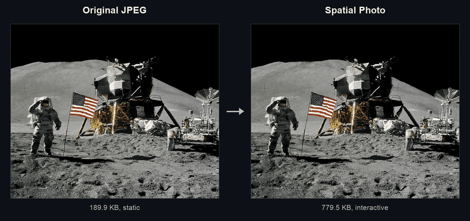

# Spatial Photos (Depth Anything V2 Fork)

> **Note:** This is a fork of the original [SpatialPhotos](https://github.com/frozein/SpatialPhotos) repository. The primary objective of this fork was to replace the proprietary Apple `ml-sharp` model and its 3D Gaussian Splatting logic (`ddgs_cpu`) with a local, open-source model optimized for macOS Apple Silicon (**Depth Anything V2** running on PyTorch with MPS). This approach significantly streamlines the dependencies and enables the direct generation of single-slice `.spatial` meshes from monocular depth maps.

Add a 3D effect to any image, and ship it anywhere with a web-ready format! This project uses **Depth Anything V2** to generate a depth map from a single image, then converts it into a compact `.spatial` format, ready to be shipped on the web and viewed anywhere.



## Quickstart

Use Python 3.11+. Clone the repository and initialize the virtual environment:

```sh
git clone https://github.com/frozein/SpatialPhotos.git
cd SpatialPhotos
python3 -m venv venv
source venv/bin/activate
pip install -r requirements.txt
```

To generate a spatial photo, run:
```sh
python predict.py input.jpg output.spatial
```

The Depth Anything V2 model checkpoint (`depth-anything/Depth-Anything-V2-Small-hf`) downloads automatically on first use.

### Batch Processing
To process an entire folder of `.webp` images, you can use the provided Zsh script (modify the script variables as needed):
```sh
./batch_process.sh
```

### Viewer
To view the output locally, use Node.js 22.12+ (or Node.js 20.19+) and run:

```sh
cd viewer
npm install
npm run dev
```

Open `/example/` on the local server and load your `.spatial` file. See the
[viewer README](viewer/README.md) for component usage and development.

## Documentation

`predict.py` accepts an image or image directory. Use a `.spatial` output path
for one image, or an output directory to save each image as `name.spatial`.
Directory inputs require a directory output.

| Option | Description |
| --- | --- |
| `--quality N` | JPEG encoding quality for both color and alpha, `0`–`100`. Default: `75`. |
| `--block-size N` | Block size in pixels, must be a multiple of 8. Smaller blocks generally lead to smaller files and higher quality, but slower processing and rendering. Default: `32`. |
| `--depth-scale FLOAT` | Intensity of the 3D depth effect. Larger values increase the depth range. Default: `0.5`. |
| `--opaque-only` | Use opaque rendering, leads smaller files, but at lower quality. |

## File Format // What is a Spatial Photo?

A spatial photo is a still image that can be viewed from slightly different
positions, giving the impression that a full 3D scene was captured. 

The image data within each block gets packed into a **texture atlas**. The atlas is a single image containing every single block. There are 2 atlases: one for the RGB color, and one for alpha. 

A `.spatial` file stores this information in three parts:

1. **Header:** 68 bytes beginning with `SPA\x00`, containing expanded image,
   original image, and atlas dimensions, slice count, block size, camera focal length, and payload lengths.
2. **Geometry:** bitmasks marking which grid corners and blocks exist. Present corners have 32-bit floating-point depths; present blocks have a pair of one-byte atlas coordinates, measured in blocks.
3. **Images:** the color JPEG followed by the grayscale alpha JPEG. Both are
   compressed using the same `--quality` setting and are lossy.

Multi-byte numeric fields are little-endian.

See [exporter.py](exporter.py) for the binary layout and encoding.

## Project structure

| Path | Purpose |
| --- | --- |
| [predict.py](predict.py) | CLI, Depth Anything V2 inference, and spatial generation. |
| [batch_process.sh](batch_process.sh) | Zsh script for processing folders of images. |
| [exporter.py](exporter.py) | Spatial serialization and JPEG encoding. |
| [viewer/](viewer/README.md) | Web component and standalone demo. |
